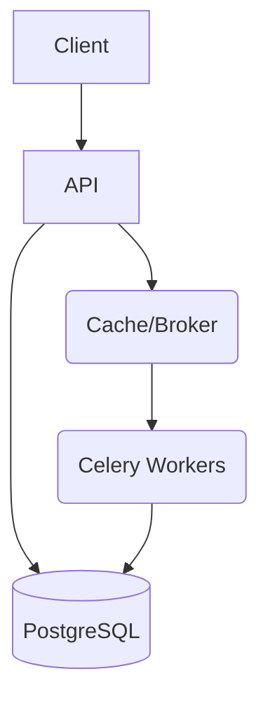

# Le Bolide (FastAPI & Async) : Microservice de Collecte et Streaming IoT / Télécom

## 📖 Description
Microservice de Collecte et Streaming IoT / Télécom avec FastAPI

## 🏗️ Choix d'Architecture
- **Stack :** FastAPI, PostgreSQL, SQLAlchemy Async
- **Pourquoi :** Optimisation des performances, scalabilité horizontale, asynchronisme natif, et respect des principes de l'architecture distribuée.
- **Numérique Responsable :** Dockerisation "Green IT" via `alpine` / `slim`, multi-stage builds, optimisation requêtes BDD (pas de N+1), cache Redis.

## 🚀 Architecture


## 🛠️ Installation Rapide (Local)

1. **Cloner le dépôt**
   ```bash
   git clone <repo_url>
   cd <project_dir>
   ```

2. **Lancer avec Docker Compose (App + DB + Redis + Worker)**
   ```bash
   docker-compose up --build
   ```

3. **Lancer les tests**
   ```bash
   docker-compose run app pytest
   ```

## 🧪 Qualité & Tests
- **Couverture :** > 85% via Pytest
- **Lintage :** Ruff, Black, Isort
- **Typage :** MyPy
- **CI/CD :** GitHub Actions
